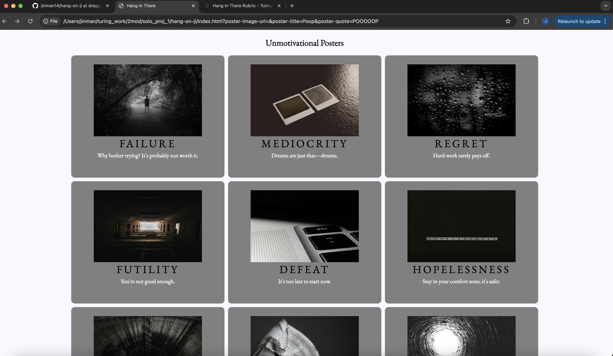

# Hang in There  

### Abstract:

This code can display and create motivational posters. If you were ever feeling down or disappointed, you could come here to get some inspiration, randomly, or self generated. If you were ever feeling too happy, it could also offer a series of unmotivational posters, to help ground you.

### Installation Instructions:

To open this, one would have to have to code on their system through cloning. When in the correct directory, they could type 'open index.html'.

### Preview of App:

### Context:

We had from the first Monday of the Mod to the second Wednesday. Mod 2 started with a bang, learning JavaScript and HTML all while using it to build a project.

### Contributors:

Me. https://github.com/jinman14/hang-on-ji/tree/main?tab=readme-ov-file

### Learning Goals:

The goal was to understand and start using HTML, JavaScript, and CSS, and see how to apply it in a possible real life situation/project. 

### Wins + Challenges:

Each time the image would appear, and the program would behave as hoped, there was a great feeling of satisfaction. Nailing the CSS at the end, and learning how to delete posters were both fun final challenges. Please don't make me do it again. With some online research and trial and error, both were solved to an acceptable level.
